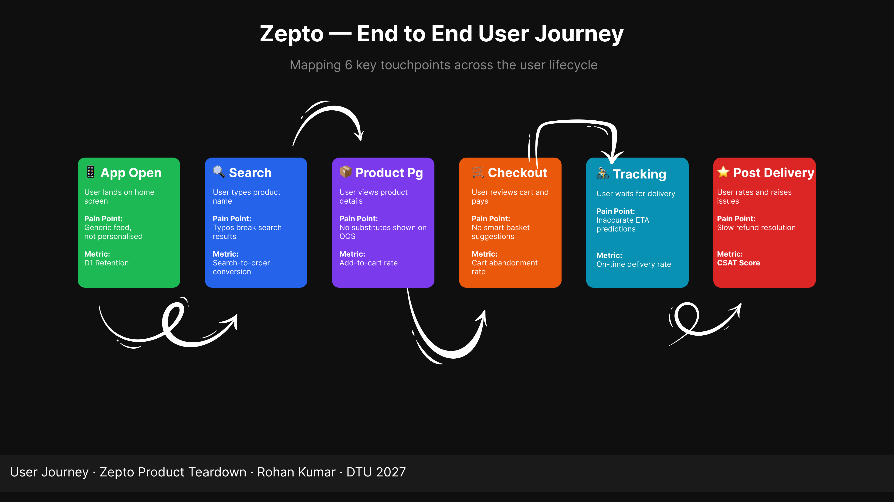
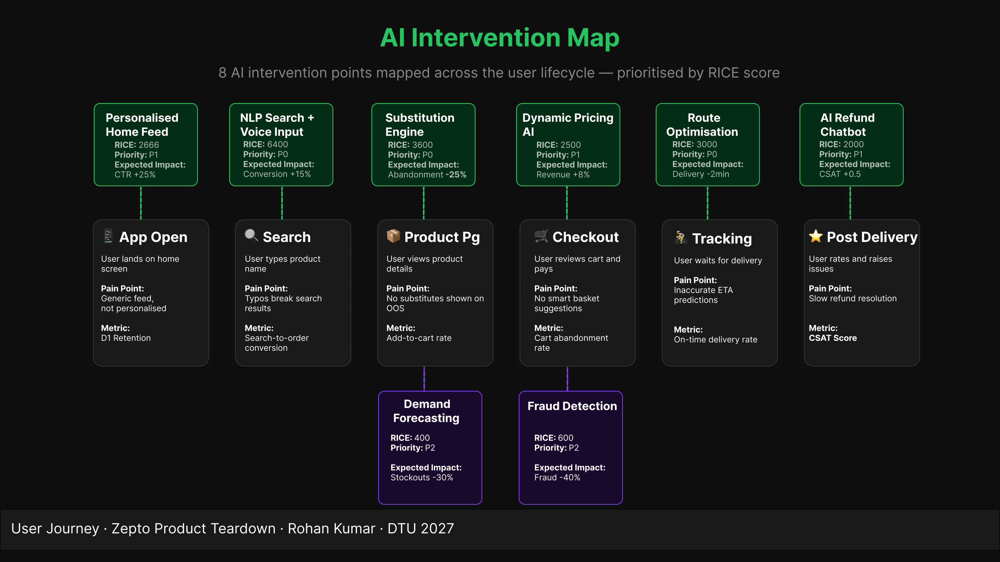

# zepto-ai-product-strategy
AI-First product strategy teardown for Zepto — mapping 8 AI intervention points using RICE, AARRR, North Star and Jobs-to-be-Done frameworks
# 🛒 Zepto AI Product Strategy — A PM Teardown

> Mapping 8 high-impact AI intervention points across 
> Zepto's user journey — prioritised using RICE scoring, 
> validated against North Star Metric.

---

## 👤 About the Author
**Rohan Kumar** | B.Tech Civil Engineering | DTU 2027  
Product Intern — drove 65x feature engagement growth at an edtech startup 
Open to 6-month hybrid PM/Product Analyst internships  
📧 rohan17ai@gmail.com

---

## 🎯 Project Overview

This is an independent product strategy teardown of **Zepto**,
India's leading quick commerce platform (10-minute delivery).

**The core question:** Where can AI create 10x value 
across Zepto's entire user workflow?

**Answer:** 8 specific intervention points — mapped, 
prioritised, and roadmapped across 8 sprints.

---

## 🔧 Frameworks Used

| Framework | Purpose |
|---|---|
| AARRR | Funnel analysis across user lifecycle |
| RICE Scoring | Feature prioritisation |
| North Star Metric | Core value measurement |
| Jobs To Be Done | Understanding user motivation |
| User Journey Mapping | End-to-end flow analysis |
| Scrum/Agile | Sprint-wise implementation planning |

---

## 🤖 8 AI Opportunities Identified

| Priority | Feature | RICE Score | Expected Impact |
|---|---|---|---|
| 🔴 P0 | NLP Search + Voice | 6400 | Conversion +15% |
| 🔴 P0 | Substitution Engine | 3600 | Abandonment -25% |
| 🔴 P0 | Route Optimisation | 3000 | Delivery time -2min |
| 🟡 P1 | Home Feed Personalisation | 2666 | CTR +25% |
| 🟡 P1 | Dynamic Pricing AI | 2500 | Revenue/order +8% |
| 🟡 P1 | AI Refund Chatbot | 2000 | CSAT +0.5 |
| 🟢 P2 | Fraud Detection | 600 | Fraud claims -40% |
| 🟢 P2 | Demand Forecasting | 400 | Stockouts -30% |

---

## ⭐ North Star Metric

**"Number of orders delivered under 10 minutes per week"**

Every AI feature proposed directly moves this number.

---

## 📊 Deliverables

| Deliverable | Tool | Link |
|---|---|---|
| Full Teardown Document | Notion | [View →](https://app.notion.com/p/AI-First-Zepto-A-Product-Strategy-Teardown-2beeee709dfd80a794c7cb7c5edba1e3?source=copy_link) |
| User Journey Map | Figma | [View →](https://www.figma.com/design/9Ymbwp8knhDDTYH45efbkt/Zepto-AI-%E2%80%94-User-Journey---AI-Intervention-Map?node-id=0-1&t=bRSr47wvsWKHHsrP-1) |
| AI Intervention Map | Figma | [View →](https://www.figma.com/design/9Ymbwp8knhDDTYH45efbkt/Zepto-AI-%E2%80%94-User-Journey---AI-Intervention-Map?node-id=0-1&t=bRSr47wvsWKHHsrP-1) |
| Sprint Planning Board | JIRA | [View →](https://dtu-team-gqfo4uqr.atlassian.net/jira/software/projects/ZAPSRK/boards/34/backlog?atlOrigin=eyJpIjoiZmI2OTFhZjY4YTcwNDJjMGFhZjllZmVjM2E1ZGE4YWUiLCJwIjoiaiJ9) |

---

## 🗓️ Product Roadmap Summary

| Sprint | Feature | Timeline |
|---|---|---|
| Sprint 1 | AI Refund Chatbot | Week 1-2 |
| Sprint 2 | NLP Search | Week 3-4 |
| Sprint 3 | Substitution Engine | Week 5-6 |
| Sprint 4 | Route Optimisation | Week 7-8 |
| Sprint 5 | Home Feed AI | Week 9-10 |
| Sprint 6 | Dynamic Pricing | Week 11-12 |
| Sprint 7 | Demand Forecasting | Week 13-14 |
| Sprint 8 | Fraud Detection | Week 15-16 |

---

## 🖼️ Project Visuals

### User Journey Map

### AI Intervention Map

---

## 🛠️ Tools Used
- **Notion** — Teardown documentation
- **Figma** — Visual diagrams
- **JIRA** — Sprint planning (Scrum)
- **GitHub** — Project repository

---

*This is an independent project for learning and 
portfolio purposes. Not affiliated with Zepto.*
